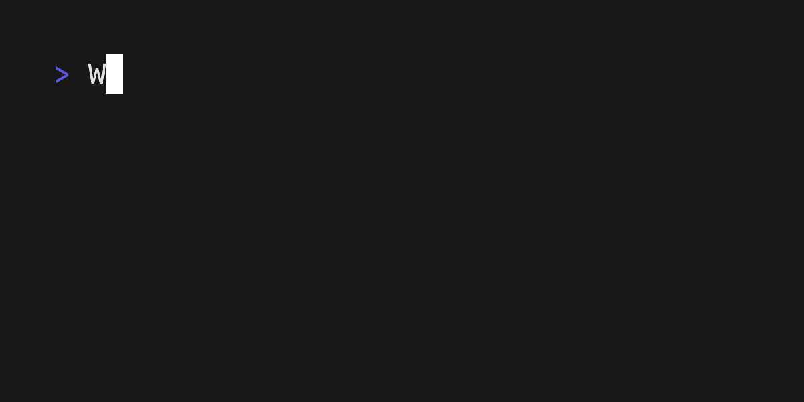
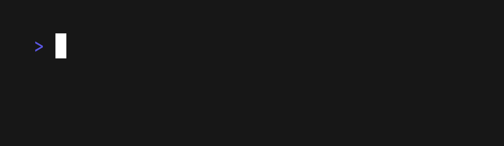
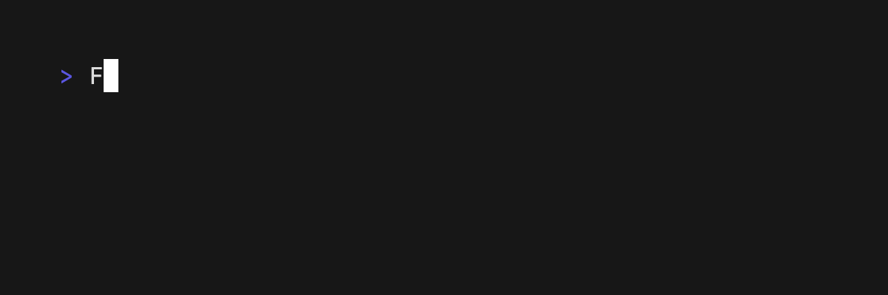

# VHS

<p>
  
  
  <br><br>
  <a href="https://github.com/charmbracelet/vhs/releases"></a>
  <a href="https://pkg.go.dev/github.com/charmbracelet/vhs?tab=doc"></a>
  <a href="https://github.com/charmbracelet/vhs/actions"></a>
</p>

Write terminal GIFs as code for integration testing and demoing your CLI tools.



Code a GIF using simple commands saved to a text file:

```elixir
# Render the output GIF to demo.gif
Output demo.gif

# Set up a 1200x600 frame with 42px font size.
Set FontSize 42
Set Width 1200
Set Height 600

Type "Welcome to VHS!"
Sleep 1
Ctrl+C
Sleep 1

Type "VHS let's you write terminal GIFs as code."
Sleep 1
Ctrl+C
Sleep 1

Type "Let's take it for a spin."
Sleep 1
Ctrl+C
Sleep 1

Type "gum spin -s line -- sleep 5"
Enter

# Note: VHS will not wait for the running command to finish. Use the sleep
# command to instruct VHS to continue recording.
Sleep 5
```

After we save these commands to a file called `demo.tape`,
we can render the GIF using the `vhs` binary:

```sh
vhs < demo.tape
```

Reach out to [vt100@charm.sh](mailto:vt100@charm.sh) to set up a VHS rendering
server with an `ssh` interface for your team to avoid any local setup.

```sh
ssh vhs.charm.sh < demo.tape > demo.gif
```

## Commands

* [`Output <path>`](#output)
* [`Set <Setting> Value`](#settings)
* [`Type "<characters>"`](#type)
* [`Sleep <time>`](#sleep)
* [`Hide`](#hide)
* [`Show`](#show)

### Keys

Key commands take an optional `@time` and repeat `count`.
For example, the following presses the `Left` key 5 times with a 0.5 second delay between each keystroke.

```elixir
Left@500ms 5
```

* [`Backspace`](#backspace)
* [`Ctrl`](#ctrl)
* [`Down`](#down)
* [`Enter`](#enter)
* [`Space`](#space)
* [`Tab`](#tab)
* [`Left`](#arrow-keys)
* [`Right`](#arrow-keys)
* [`Up`](#arrow-keys)
* [`Down`](#arrow-keys)

### Settings

The `Set` command allows you to change aspects of the terminal, such as the font settings, window dimensions, and output GIF location.

* [`Set FontSize <Number>`](#set-font-size)
* [`Set FontFamily <String>`](#set-font-family)
* [`Set Height <Number>`](#set-height)
* [`Set Width <Number>`](#set-width)
* [`Set LetterSpacing <Float>`](#set-letter-spacing)
* [`Set LineHeight <Float>`](#set-line-height)
* [`Set TypingSpeed <Time>`](#set-typing-speed)
* [`Set Theme <String>`](#set-theme)
* [`Set Padding <Number>[em|px]`](#set-padding)
* [`Set Framerate <Number>`](#set-framerate)

### Sleep

The `Sleep` command allows you to continue capturing frames without interacting
with the terminal. This is useful when you need to wait on something to
complete while including it in the recording like a spinner or loading state.
The command takes a number argument in seconds.

```elixir
Sleep 0.5   # 500ms
Sleep 2     # 2s
Sleep 100ms # 100ms
Sleep 1s    # 1s
```

### Type

The `Type` command allows you to type in the terminal and emulate key presses.
This is useful for typing commands or interacting with the terminal.
The command takes a string argument with the characters to type.

```elixir
Type "Whatever you want"
```


### Output

The `Output` command allows you to specify the location and file format
of the render. You can specify more than one output in a tape file which
will render them to the respective locations.

```elixir
Output out.gif
Output out.mp4
Output out.webm
Output frames/frame-%05d.png
```

### Keys

#### Backspace

Press the backspace key with the `Backspace` command.

```elixir
Backspace 18
```


#### Ctrl

Press a control sequence with the `Ctrl` command.

```elixir
Ctrl+R
```


#### Enter

Press the enter key with the `Enter` command.

```elixir
Enter 2
```



#### Arrow Keys

Press any of the arrow keys with the `Up`, `Down`, `Left`, `Right` commands.

```elixir
Up 2
Down 3
Left 10
Right 10
```


#### Tab

Press the tab key with the `Tab` command.

```elixir
Tab@500ms 2
```


#### Space

Press the space bar with the `Space` command.

```elixir
Space 10
```


### Settings

#### Set Font Size

Set the font size with the `Set FontSize <Number>` command.

```elixir
Set FontSize 10
Set FontSize 20
Set FontSize 30
Set FontSize 40
```


#### Set Font Family

Set the font family with the `Set FontFamily "<Font>"` command

```elixir
Set FontFamily "Fira Code"
Set FontFamily "Menlo"
Set FontFamily "Monaco"
Set FontFamily "Monoflow"
Set FontFamily "SF Mono"
```


#### Set Height

Set the height of the terminal with the `Set Height` command.

```elixir
Set Height 600
Set Height 1000
```

#### Set Width

Set the width of the terminal with the `Set Width` command.

```elixir
Set Width 1200
Set Width 2000
```

#### Set Letter Spacing

Set the spacing between letters (tracking) with the `Set LetterSpacing` Command.

```elixir
Set LetterSpacing 1.2
Set LetterSpacing 2.4
Set LetterSpacing 3.6
```


#### Set Line Height

```elixir
Set LineHeight 1.4
Set LineHeight 1.6
Set LineHeight 1.8
```

Set the spacing between lines with the `Set LineHeight` Command.


#### Set Typing Speed

```elixir
Set TypingSpeed 500ms # 500ms
Set TypingSpeed 1s    # 1s
```

Set the typing speed of seconds per key press. For example, a typing speed of
0.1 would result in a 100ms delay between each character being typed.

This setting can also be overridden per command with the `@<time>` syntax.

```elixir
Set TypingSpeed 0.1
Type "100ms delay per character"
Type@500ms "500ms delay per character"
```



#### Set Theme

Set the theme of the terminal with the `Set Theme` command.
The theme value should be a JSON string with the base 16 colors and foreground + background.

```elixir
Set Theme { "name": "Whimsy", "black": "#535178", "red": "#ef6487", "green": "#5eca89", "yellow": "#fdd877", "blue": "#65aef7", "purple": "#aa7ff0", "cyan": "#43c1be", "white": "#ffffff", "brightBlack": "#535178", "brightRed": "#ef6487", "brightGreen": "#5eca89", "brightYellow": "#fdd877", "brightBlue": "#65aef7", "brightPurple": "#aa7ff0", "brightCyan": "#43c1be", "brightWhite": "#ffffff", "background": "#29283b", "foreground": "#b3b0d6", "selectionBackground": "#3d3c58", "cursorColor": "#b3b0d6" }
Set Theme { "name": "wilmersdorf", "black": "#34373e", "red": "#e06383", "green": "#7ebebd", "yellow": "#cccccc", "blue": "#a6c1e0", "purple": "#e1c1ee", "cyan": "#5b94ab", "white": "#ababab", "brightBlack": "#434750", "brightRed": "#fa7193", "brightGreen": "#8fd7d6", "brightYellow": "#d1dfff", "brightBlue": "#b2cff0", "brightPurple": "#efccfd", "brightCyan": "#69abc5", "brightWhite": "#d3d3d3", "background": "#282b33", "foreground": "#c6c6c6", "selectionBackground": "#1f2024", "cursorColor": "#7ebebd" }
Set Theme { "name": "Wombat", "black": "#000000", "red": "#ff615a", "green": "#b1e969", "yellow": "#ebd99c", "blue": "#5da9f6", "purple": "#e86aff", "cyan": "#82fff7", "white": "#dedacf", "brightBlack": "#313131", "brightRed": "#f58c80", "brightGreen": "#ddf88f", "brightYellow": "#eee5b2", "brightBlue": "#a5c7ff", "brightPurple": "#ddaaff", "brightCyan": "#b7fff9", "brightWhite": "#ffffff", "background": "#171717", "foreground": "#dedacf", "selectionBackground": "#453b39", "cursorColor": "#bbbbbb" }
Set Theme { "name": "Wryan", "black": "#333333", "red": "#8c4665", "green": "#287373", "yellow": "#7c7c99", "blue": "#395573", "purple": "#5e468c", "cyan": "#31658c", "white": "#899ca1", "brightBlack": "#3d3d3d", "brightRed": "#bf4d80", "brightGreen": "#53a6a6", "brightYellow": "#9e9ecb", "brightBlue": "#477ab3", "brightPurple": "#7e62b3", "brightCyan": "#6096bf", "brightWhite": "#c0c0c0", "background": "#101010", "foreground": "#999993", "selectionBackground": "#4d4d4d", "cursorColor": "#9e9ecb" }
Set Theme { "name": "Abernathy", "black": "#000000", "red": "#cd0000", "green": "#00cd00", "yellow": "#cdcd00", "blue": "#1093f5", "purple": "#cd00cd", "cyan": "#00cdcd", "white": "#faebd7", "brightBlack": "#404040", "brightRed": "#ff0000", "brightGreen": "#00ff00", "brightYellow": "#ffff00", "brightBlue": "#11b5f6", "brightPurple": "#ff00ff", "brightCyan": "#00ffff", "brightWhite": "#ffffff", "background": "#111416", "foreground": "#eeeeec", "selectionBackground": "#eeeeec", "cursorColor": "#bbbbbb" }
```


#### Set Padding

Set the padding of the terminal frame with the `Set Padding` command.

```elixir
Set Padding 1em
Set Padding 2em
Set Padding 3em
Set Padding 4em
Set Padding 5em
```


#### Set Framerate

Set the rate at which VHS captures frames with the `Set Framerate` command.

```elixir
Set Framerate 60
```

### Hide

The `Hide` command allows you to specify that the following commands should not
be shown in the output.

```elixir
Hide
```

### Show

The `Show` command allows you to specify that the following commands should
be shown in the output. Since this is the default case, the show command will
usually be seen with the `Hide` command.

```elixir
Hide
Type "You won't see this being typed."
Show
Type "You will see this being typed."
```


## Feedback

We’d love to hear your thoughts on this project. Feel free to drop us a note!

* [Twitter](https://twitter.com/charmcli)
* [The Fediverse](https://mastodon.technology/@charm)
* [Slack](https://charm.sh/slack)

## License

[MIT](https://github.com/charmbracelet/vhs/raw/main/LICENSE)

---

Part of [Charm](https://charm.sh).

<a href="https://charm.sh/"></a>

Charm热爱开源 • Charm loves open source
