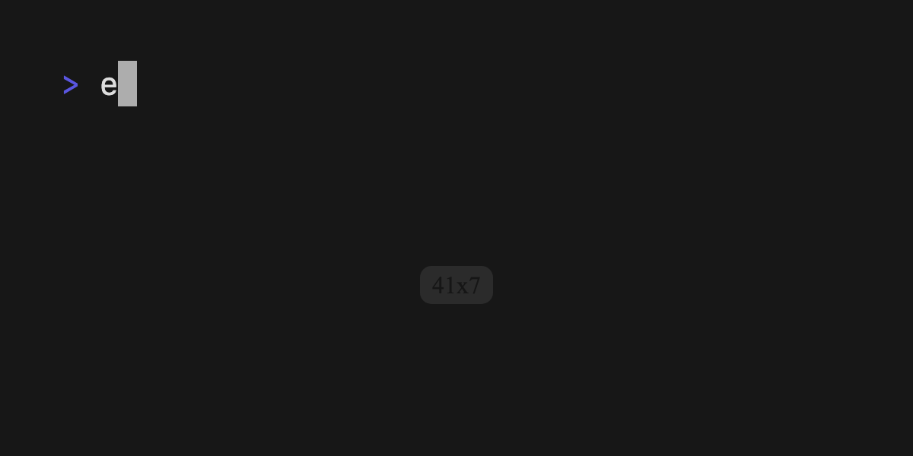

# Dolly

Programmatically record GIFs for terminal applications with Go 🎬



The above example is generated from a single Go file ([source](./examples/demo/main.go))

## Tutorial

Instantiate a new `dolly` with any options you want.

```go
d := dolly.New(dolly.WithOutput("demo.gif"), dolly.WithFontSize(32))
```

Next `defer` the `Cleanup` function to tear down the spawned processes. This removes the generated frames and compiles the final GIF.

```go
defer d.Cleanup()
```

Type anything you want with any options. We will type this with a 50ms delay between keystrokes.

```go
d.Type("echo 'Hello, Demo!'", dolly.WithSpeed(50))
d.Enter()
```

You can sleep at any point in the process and the delay will show up in your GIF. This is because `dolly` captures frames automatically in the background.

```go
time.Sleep(1 * time.Second)
```

Putting it all together...

```go
package main

import (
	"time"

	"github.com/charmbracelet/dolly"
)

func main() {
	d := dolly.New(dolly.WithFontSize(42), dolly.WithOutput("demo.gif"))
	defer d.Cleanup()
	d.Type("echo 'Hello, Demo!'", dolly.WithSpeed(100), dolly.WithVariance(0.5))
	d.Enter()
	time.Sleep(time.Second)
}
```

Running this program will output a GIF in the same folder with the name given by `dolly.WithOutput` (`demo.gif`).


## API

See [Go Doc](https://pkg.go.dev/github.com/charmbracelet/dolly) for latest documentation.

### New

`New` instantiates and returns a new `Dolly` and begins capturing frames of the terminal in the background.

```go
func New(opts ...SetupOption) Dolly
```

Example usage:

```go
d := dolly.New(
	dolly.WithFolder("tmp"),
	dolly.WithFontSize(22),
	dolly.WithFormat("frame-%02.png"),
	dolly.WithFramerate(60),
	dolly.WithHeight(600),
	dolly.WithPadding("5em"),
	dolly.WithWidth(1200),
)
```

### Type

`Type` a string into the terminal with configurable options.

```go
func (d Dolly) Type(str string, opts ...TypeOption)
```

For example, `Type` a command with 100ms between each keystroke and a randomization of 50% of the delay.

```go
d.Type("echo 'Hello, Demo!'", dolly.WithSpeed(100), dolly.WithVariance(0.5))
```

### Helpers

```go
// Enter presses the return key on the terminal
d.Enter()

// Clear clears the screen (ctrl+l)
d.Clear()

// CtrlC press the ctrl+c key combination on the terminal
d.CtrlC()

// Press the arrow keys on the terminal (↑↓←→)
d.Up()
d.Down()
d.Left()
d.Right()
```

## Setup

Dolly is a library with which to write Go programs.
You do not need to _install_ `dolly` on to your machine (just import it in your Go programs).
However, when running a `dolly` program, `dolly` will spawn the following programs which must be present on the machine:

* [`ttyd`](https://github.com/tsl0922/ttyd): to launch a terminal in the browser for programmatic control.
* [`ffmpeg`](https://github.com/ffmpeg/ffmpeg): to compile the frames into a GIF.

Install them with your favorite package manager:

```bash
# macOS or Linux
brew install ffmpeg ttyd

# Arch Linux (btw)
pacman -S ffmpeg
yay -S ttyd

# Nix
nix-env -iA nixpkgs.ttyd nixpkgs.ffmpeg
```

## Examples

* [Gum `README` GIFs](./examples/gum)
* [Soft Serve GIF](./examples/soft-serve)

## Feedback

We’d love to hear your thoughts on this project. Feel free to drop us a note!

* [Twitter](https://twitter.com/charmcli)
* [The Fediverse](https://mastodon.technology/@charm)
* [Slack](https://charm.sh/slack)

## License

[MIT](https://github.com/charmbracelet/dolly/raw/main/LICENSE)

---

Part of [Charm](https://charm.sh).

<a href="https://charm.sh/"></a>

Charm热爱开源 • Charm loves open source
