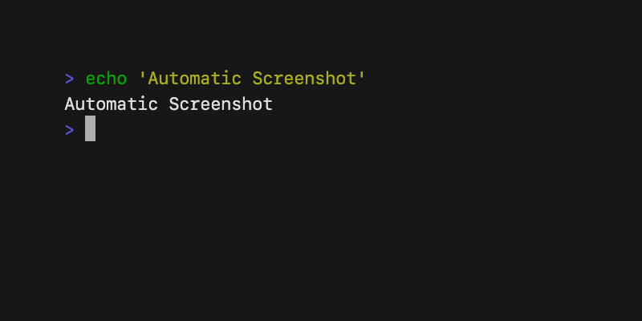

# Recorder

Automatically record and take screenshots of a terminal programmatically.

```go
	page.MustElement("textarea").MustInput("echo 'Automatic Screenshot'").MustType(input.Enter)
	page.MustWaitIdle()
	page.MustScreenshot("out.png")
```

 

Update the `main.go` file to perform the actions you need to screenshot and
then run the file. This will automatically spawn
[`ttyd`](https://github.com/tsl0922/ttyd) (which must be installed) and then
perform the actions via [`go-rod`](https://github.com/go-rod/rod).

```bash
go run main.go
```
# frame
