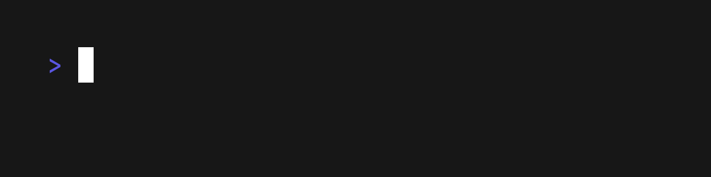
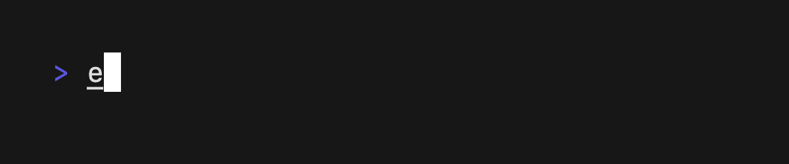
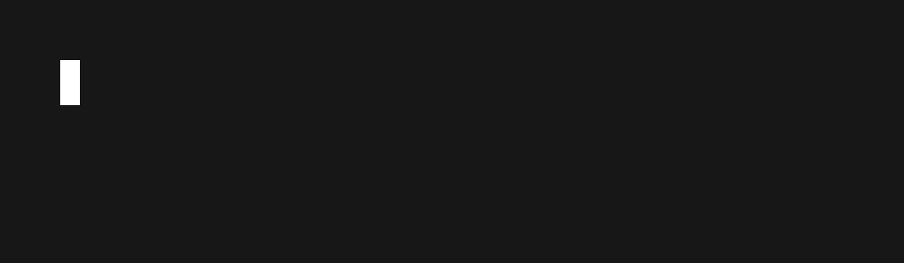
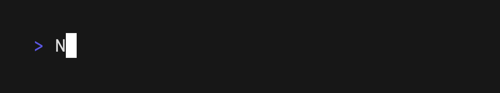
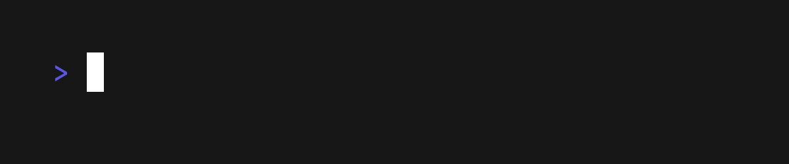
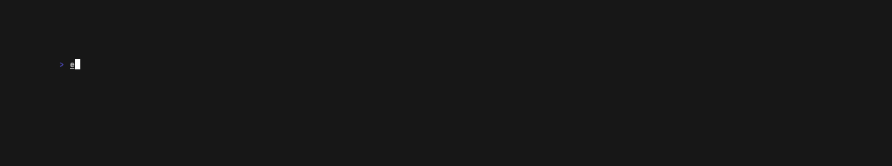
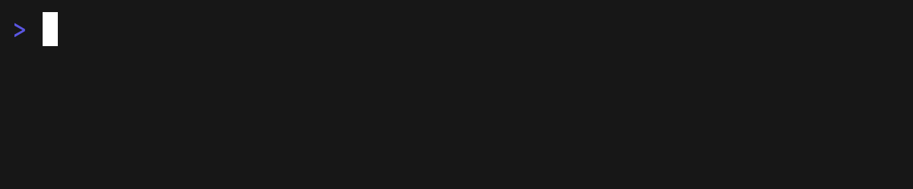

# VHS

## Commands

* [`Set <Setting> Value`](#settings)
* [`Sleep <time>`](#sleep)
* [`Type "<characters>"`](#type)

### Keys

Key commands take an optional `@time` and repeat `count`.
For example, the following presses the `Left` key 5 times with a 500 millisecond delay between each keystroke.

```
Left@500ms 5
```

* [`Backspace`](#backspace)
* [`Ctrl`](#ctrl)
* [`Down`](#down)
* [`Enter`](#enter)
* [`Space`](#space)
* [`Tab`](#tab)
* [`Left`](#arrow-keys)
* [`Right`](#arrow-keys)
* [`Up`](#arrow-keys)
* [`Down`](#arrow-keys)

### Settings

The `Set` command allows you to change aspects of the terminal, such as the font settings, window dimensions, and output GIF location.

* [`Set FontSize <Number>`](#set-font-size)
* [`Set FontFamily <String>`](#set-font-family)
* [`Set Height <Number>`](#set-height)
* [`Set Width <Number>`](#set-width)
* [`Set LetterSpacing <Float>`](#set-letter-spacing)
* [`Set LineHeight <Float>`](#set-line-height)
* [`Set Theme <String>`](#set-theme)
* [`Set Padding <Number>[em|px]`](#set-padding)
* [`Set Framerate <Number>`](#set-framerate)
* [`Set Output <Path>`](#set-output)

### Sleep

The `Sleep` command allows you to continue capturing frames without interacting with the terminal.
This is useful when you need to wait on something to complete while including it in the recording like a spinner or loading state.
The command takes a time argument with optional units (`s` or `ms`) by default the units are in `ms`.

```
Sleep 2s
Sleep 500ms
Sleep 2000
```

### Type

The `Type` command allows you to type in the terminal and emulate key presses.
This is useful for typing commands or interacting with the terminal.
The command takes a string argument with the characters to type.

```
Type "Whatever you want"
```



### Keys

#### Backspace

Press the backspace key with the `Backspace` command.

```
Backspace 18
```


#### Ctrl

Press a control sequence with the `Ctrl` command.

```
Ctrl+R
```



#### Enter

Press the enter key with the `Enter` command.

```
Enter 2
```



#### Arrow Keys

Press any of the arrow keys with the `Up`, `Down`, `Left`, `Right` commands.

```
Up 2
Down 3
Left 10
Right 10
```



#### Tab

Press the tab key with the `Tab` command.

```
Tab@500ms 2
```



#### Space

Press the space bar with the `Space` command.

```
Space 10
```


### Settings

#### Set Font Size

Set the font size with the `Set FontSize <Number>` command.

```
Set FontSize 10
Set FontSize 20
Set FontSize 30
Set FontSize 40
```



#### Set Font Family

Set the font family with the `Set FontFamily "<Font>"` command

```
Set FontFamily "Fira Code"
Set FontFamily "Menlo"
Set FontFamily "Monaco"
Set FontFamily "Monoflow"
Set FontFamily "SF Mono"
```


#### Set Height

Set the height of the terminal with the `Set Height` command.

```
Set Height 600
Set Height 1000
```

#### Set Width

Set the width of the terminal with the `Set Width` command.

```
Set Width 1200
Set Width 2000
```

#### Set Letter Spacing

Set the spacing between letters (tracking) with the `Set LetterSpacing` Command.


#### Set Line Height

Set the spacing between lines with the `Set LineHeight` Command.


#### Set Theme

Set the theme of the terminal with the `Set Theme` command.
The theme value should be a JSON string with the base 16 colors and foreground + background.

```
Set Theme { "name": "Whimsy", "black": "#535178", "red": "#ef6487", "green": "#5eca89", "yellow": "#fdd877", "blue": "#65aef7", "purple": "#aa7ff0", "cyan": "#43c1be", "white": "#ffffff", "brightBlack": "#535178", "brightRed": "#ef6487", "brightGreen": "#5eca89", "brightYellow": "#fdd877", "brightBlue": "#65aef7", "brightPurple": "#aa7ff0", "brightCyan": "#43c1be", "brightWhite": "#ffffff", "background": "#29283b", "foreground": "#b3b0d6", "selectionBackground": "#3d3c58", "cursorColor": "#b3b0d6" }
Set Theme { "name": "wilmersdorf", "black": "#34373e", "red": "#e06383", "green": "#7ebebd", "yellow": "#cccccc", "blue": "#a6c1e0", "purple": "#e1c1ee", "cyan": "#5b94ab", "white": "#ababab", "brightBlack": "#434750", "brightRed": "#fa7193", "brightGreen": "#8fd7d6", "brightYellow": "#d1dfff", "brightBlue": "#b2cff0", "brightPurple": "#efccfd", "brightCyan": "#69abc5", "brightWhite": "#d3d3d3", "background": "#282b33", "foreground": "#c6c6c6", "selectionBackground": "#1f2024", "cursorColor": "#7ebebd" }
Set Theme { "name": "Wombat", "black": "#000000", "red": "#ff615a", "green": "#b1e969", "yellow": "#ebd99c", "blue": "#5da9f6", "purple": "#e86aff", "cyan": "#82fff7", "white": "#dedacf", "brightBlack": "#313131", "brightRed": "#f58c80", "brightGreen": "#ddf88f", "brightYellow": "#eee5b2", "brightBlue": "#a5c7ff", "brightPurple": "#ddaaff", "brightCyan": "#b7fff9", "brightWhite": "#ffffff", "background": "#171717", "foreground": "#dedacf", "selectionBackground": "#453b39", "cursorColor": "#bbbbbb" }
Set Theme { "name": "Wryan", "black": "#333333", "red": "#8c4665", "green": "#287373", "yellow": "#7c7c99", "blue": "#395573", "purple": "#5e468c", "cyan": "#31658c", "white": "#899ca1", "brightBlack": "#3d3d3d", "brightRed": "#bf4d80", "brightGreen": "#53a6a6", "brightYellow": "#9e9ecb", "brightBlue": "#477ab3", "brightPurple": "#7e62b3", "brightCyan": "#6096bf", "brightWhite": "#c0c0c0", "background": "#101010", "foreground": "#999993", "selectionBackground": "#4d4d4d", "cursorColor": "#9e9ecb" }
Set Theme { "name": "Abernathy", "black": "#000000", "red": "#cd0000", "green": "#00cd00", "yellow": "#cdcd00", "blue": "#1093f5", "purple": "#cd00cd", "cyan": "#00cdcd", "white": "#faebd7", "brightBlack": "#404040", "brightRed": "#ff0000", "brightGreen": "#00ff00", "brightYellow": "#ffff00", "brightBlue": "#11b5f6", "brightPurple": "#ff00ff", "brightCyan": "#00ffff", "brightWhite": "#ffffff", "background": "#111416", "foreground": "#eeeeec", "selectionBackground": "#eeeeec", "cursorColor": "#bbbbbb" }
```


#### Set Padding

Set the padding of the terminal frame with the `Set Padding` command.

```
Set Padding 1em
Set Padding 2em
Set Padding 3em
Set Padding 4em
Set Padding 5em
```



#### Set Framerate

Set the rate at which VHS captures frames with the `Set Framerate` command.

```
Set Framerate 60
```

#### Set Output

Set the location at which to save the final rendered GIF with the `Set Output` command.

```
Set Output ./path/to/save.gif
```

## Feedback

We’d love to hear your thoughts on this project. Feel free to drop us a note!

* [Twitter](https://twitter.com/charmcli)
* [The Fediverse](https://mastodon.technology/@charm)
* [Slack](https://charm.sh/slack)

## License

[MIT](https://github.com/charmbracelet/vhs/raw/main/LICENSE)

---

Part of [Charm](https://charm.sh).

<a href="https://charm.sh/"></a>

Charm热爱开源 • Charm loves open source
