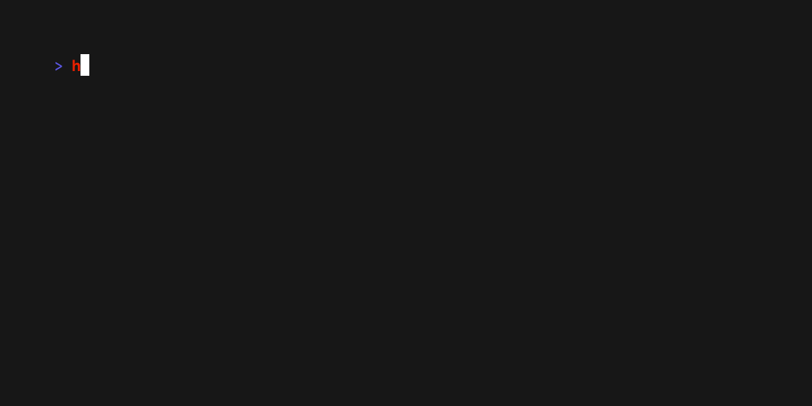

# Dolly

Programatically record frames of a terminal and output GIFs. 🎬

```go
for _, kp := range keys.Type("echo 'Hello, Demo!'") {
    time.Sleep(time.Millisecond * 100)
    page.Keyboard.Type(kp)
    page.MustWaitIdle()
}

page.Keyboard.Type(input.Enter)
time.Sleep(time.Second)
```



Update the `main.go` file to perform the actions you need to screenshot and
then run the file. This will automatically spawn
[`ttyd`](https://github.com/tsl0922/ttyd) (which must be installed) and then
perform the actions via [`go-rod`](https://github.com/go-rod/rod).

```bash
go run .
