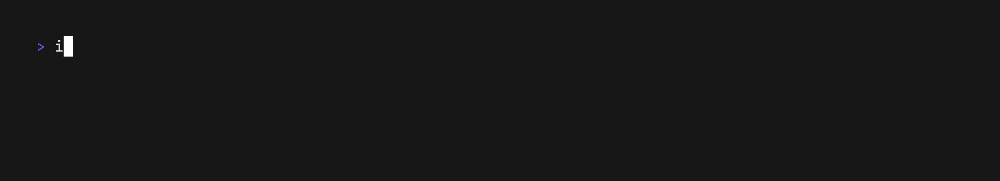

# CLI UI

### Format



```
Output examples/cli-ui/format.gif

Set FontSize 32

Set Width 2200
Set Height 400

Hide
Type "irb --noautocomplete"
Enter
Type "require 'cli/ui'"
Enter
Type "CLI::UI::StdoutRouter.enable"
Enter
Ctrl+L
Show

Type 'puts CLI::UI.fmt "{{red:Red}} {{green:Green}}"'
Sleep .5
Enter
Sleep 5
```

### Nested Frames


```
Output examples/cli-ui/nested-frames.gif

Set FontSize 32

Set Width 2000
Set Height 750

Hide
Type "irb --noautocomplete"
Enter
Type "require 'cli/ui'"
Enter
Type "CLI::UI::StdoutRouter.enable"
Enter
Ctrl+L
Show

Type "CLI::UI::Frame.open('Frame 1') do"
Enter
Type "  CLI::UI::Frame.open('Frame 2') { puts 'inside frame 2' }"
Enter
Type "  puts 'inside frame 1'"
Enter
Type "end"

Sleep 1

Enter

Sleep 3
```

### Progress


```
Output examples/cli-ui/progress.gif

Set FontSize 32

Set Width 2200
Set Height 400

Hide
Type "irb --noautocomplete"
Enter
Type "require 'cli/ui'"
Enter
Type "CLI::UI::StdoutRouter.enable"
Enter
Ctrl+L
Show

Type "CLI::UI::Progress.progress { |bar| 100.times { sleep 0.02; bar.tick } }"
Sleep .5
Enter
Sleep 5
```

### Spinner


```
Output examples/cli-ui/spinner.gif

Set FontSize 32

Set Width 2200
Set Height 400

Hide
Type "irb --noautocomplete"
Enter
Type "require 'cli/ui'"
Enter
Type "CLI::UI::StdoutRouter.enable"
Enter
Ctrl+L
Show

Type "CLI::UI::Spinner.spin('Spinning...') { sleep 3 }"
Sleep .5
Enter
Sleep 5
```

### Status Widget


```
Output examples/cli-ui/status-widget.gif

Set FontSize 32

Set Width 2200
Set Height 400

Hide
Type "irb --noautocomplete"
Enter
Type "require 'cli/ui'"
Enter
Type "CLI::UI::StdoutRouter.enable"
Enter
Ctrl+L
Show

Type 'CLI::UI::Spinner.spin("Building: {{@widget/status:1:2:3:4}}") { |spinner| sleep 3 }'
Sleep .5
Enter
Sleep 5
```

### Symbols


```
Output examples/cli-ui/symbols.gif

Set FontSize 32

Set Width 2200
Set Height 400

Hide
Type "irb --noautocomplete"
Enter
Type "require 'cli/ui'"
Enter
Type "CLI::UI::StdoutRouter.enable"
Enter
Ctrl+L
Show

Type 'puts CLI::UI.fmt "{{*}} {{v}} {{?}} {{x}}"'
Sleep .5
Enter
Sleep 5
```

### Text Prompt


```
Output examples/cli-ui/text-prompt.ascii
Output examples/cli-ui/text-prompt.gif

Set FontSize 32

Set Width 2200
Set Height 500

Hide
Type "irb --noautocomplete"
Enter
Type "require 'cli/ui'"
Enter
Type "CLI::UI::StdoutRouter.enable"
Enter
Ctrl+L
Show

Type "CLI::UI.ask('Is CLI UI Awesome?', default: 'It is great!')"
Sleep .5
Enter
Sleep 1
Type "I love it!"
Sleep 1
Enter
Sleep 3
```
