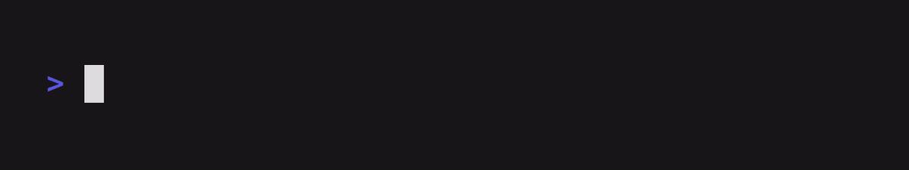

# Commands

### Arrow


```
Output examples/commands/arrow.gif
Set FontSize 42
Set Height 225

Type "Navigate around"
Sleep .25
Left 10
Sleep 1
Right@50ms 10
Sleep 1
```

### Backspace


```
Output examples/commands/backspace.gif
Set FontSize 42
Set Height 225

Type@50ms "Delete anything..."
Backspace 18
Sleep 1
```

### Comment


```
Output examples/commands/comment.gif
Set Height 500
Set Width 1000

# This is a comment.
# These are ignored by the parser so you can write whatever you want!

# Quickly comment out a command you don't need.
# Type "Hello, world!"

Sleep 1
```

### Ctrl


```
Output examples/commands/ctrl.gif
Set FontSize 42
Set Height 225

Sleep 1
Ctrl+R
Sleep 1
```

### Enter


```
Output examples/commands/enter.gif
Set FontSize 42
Set Height 350

Sleep 1
Enter@.5 2
Sleep 1
```

### Hide


```
Output examples/commands/hide.gif

Set FontSize 42
Set Height 300

Hide
Type "You won't see this being typed." Ctrl+C
Show
Type "You will see this being typed."

Sleep 2
```

### Show


```
Output examples/commands/show.gif

Hide
Type "export HIDDEN=wow"
Enter
Ctrl+L
Show

Type "echo $HIDDEN"
Enter
Sleep 1
```

### Space


```
Output examples/commands/space.gif
Set FontSize 42
Set Height 225

Sleep .25
Space 10
Sleep 1
```

### Tab


```
Output examples/commands/tab.gif
Set FontSize 42
Set Height 300

Type "cd ."
Sleep 0.5s
Tab@0.5s 2
Sleep 1s
```

### Type



```
Output examples/commands/type.gif
Set FontSize 42
Set Height 225

Sleep 1

# Type something
Type "Whatever you want"

Sleep 1 Ctrl+U  Sleep 1

# Type something really slowly!
Type@500ms "Slow down there, partner."

Sleep 1
```

